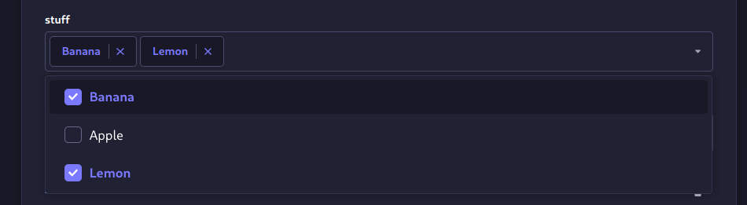
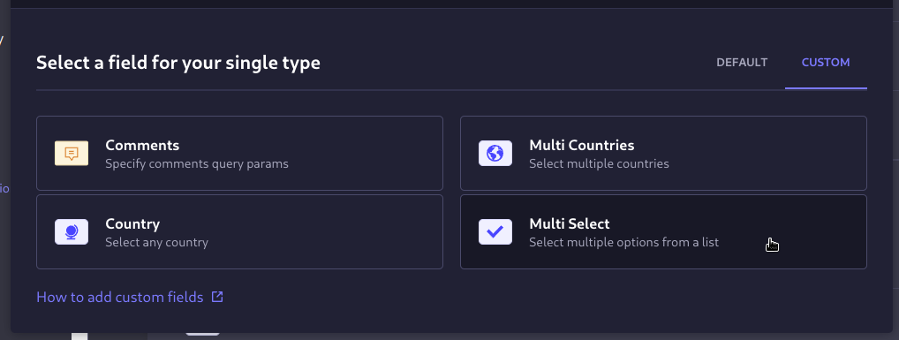
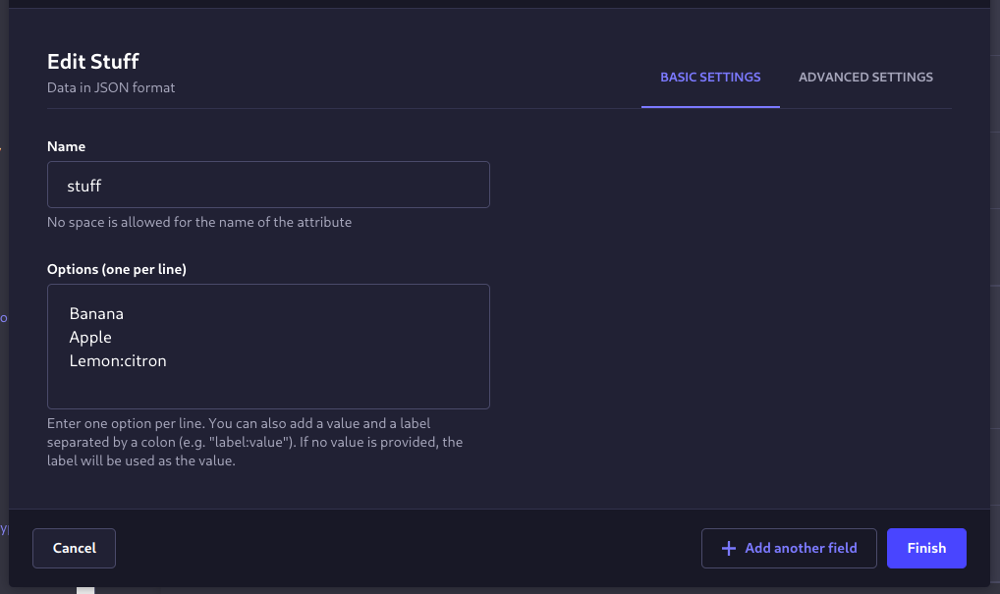

# Strapi plugin multi-enum-select

## A strapi custom field for selecting multiple Enum options from a provided list of items



- Forked from (<https://github.com/Zaydme/strapi-plugin-multi-select>) and make it with a string type instead of json for filtering

### Installation

To install this plugin, you need to add an NPM dependency to your Strapi application:

```sh
# Using Yarn
yarn add strapi-plugin-multi-enum-select

# Or using NPM
npm install strapi-plugin-multi-enum-select
```

Then, you'll need to build your admin panel:

```sh
# Using Yarn
yarn build

# Or using NPM
npm run build
```

### Usage

After installation you will find the multi-enum-select at the custom fields section of the content-type builder.



You add options to the multi-enum-select by adding a line separated list of options to the options field.

You can also add a value and a label separated by a colon (e.g. `label:value`). If no value is provided, the label will be used as the value.



then you can select one or more options from the list.


in this case the API will return

```json
{
  "data": {
    "id": 1,
    "stuff": "Banana,citron"
  }
}
```

where you can filter it with `$eq` or `$contains` or .etc

and you can parse it with:

```ts
const values = stuf.split(',');
```

### why it's better than the original plugin

1- string types are faster for data retrieving ond have hiegher performance

2- now you can filter the results with the fields you've created

3- so simple to sanitize the data to array again

---

Thanks for installing

here is the original plugin:
<https://github.com/Zaydme/strapi-plugin-multi-select>

---

You can also check the [multi-country-select](https://github.com/zaydme/strapi-plugin-multi-country-select) plugin
